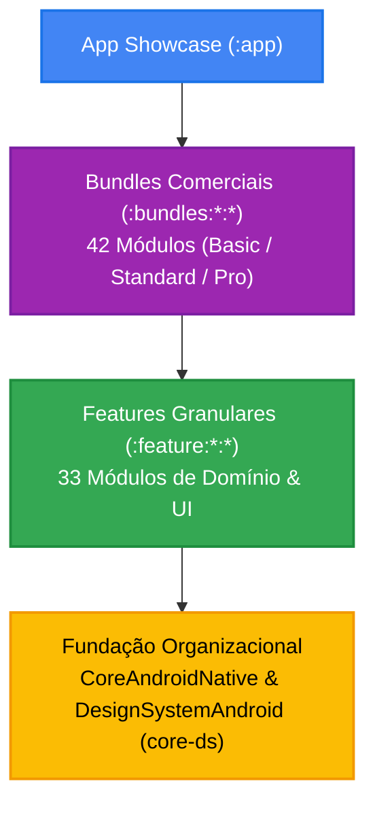

# CommonsAndroidNative 🚀

[](https://github.com/Gabriel-do-Carmo-97/CommonsAndroidNative/actions)


**CommonsAndroidNative** é o monorepo de bibliotecas, módulos funcionais e SDKs corporativos reutilizáveis da organização **WGC**, projetado para acelerar a construção de aplicativos móveis comerciais, e-commerce, delivery, prestação de serviços, fintech e soluções white-label em escala.

Todos os artefatos são publicados individualmente e centralizados no **GitHub Packages** sob o namespace corporativo **`br.com.wgc:*`**.

---

## 🏛️ Arquitetura e Catálogo de Módulos

O repositório é composto por **33 módulos de feature granulares** (em `feature/`) e **42 bundles comerciais integrados** (em `bundles/`), operando sob **Clean Architecture** estrita com Jetpack Compose, Coroutines/Flows, Hilt e integração nativa ao **OmniBackend** e **DesignSystemAndroid** (`core-ds`).



---

## 📦 1. Módulos de Feature Granulares (33 Módulos por Domínio)

Os módulos estão divididos por áreas de negócio sob a convenção `:feature:<domínio>:<nome>`, com namespace padronizado em **`br.com.wgc.<nome>`**:

### 🚀 Showcase & Demonstração
| Módulo | Tipo | Namespace | Descrição |
| :--- | :--- | :--- | :--- |
| [`:app`](./app) | Aplicação | `br.com.wgc.commonsandroidnative` | Showcase interativo com BottomBar para validar e testar todos os módulos. |

### 🔐 Auth & Segurança (`feature/auth/`)
| Módulo | Tipo | Namespace | Descrição |
| :--- | :--- | :--- | :--- |
| [`:feature:auth:authentication`](./feature/auth/authentication) | Biblioteca | `br.com.wgc.authentication` | Fluxos de Login, Cadastro e Recuperação com OmniBackend. |
| [`:feature:auth:biometric`](./feature/auth/biometric) | Biblioteca | `br.com.wgc.biometric` | Autenticação Biométrica (BiometricPrompt), App Lock e PIN. |

### 👤 Conta & Perfil (`feature/account/`)
| Módulo | Tipo | Namespace | Descrição |
| :--- | :--- | :--- | :--- |
| [`:feature:account:onboarding`](./feature/account/onboarding) | Biblioteca | `br.com.wgc.onboarding` | Pagers de boas-vindas, onboarding e solicitação de permissões. |
| [`:feature:account:profile`](./feature/account/profile) | Biblioteca | `br.com.wgc.profile` | Perfil do usuário, avatar, gestão de endereços e consentimentos LGPD. |
| [`:feature:account:settings`](./feature/account/settings) | Biblioteca | `br.com.wgc.settings` | Configurações, preferências de notificações e temas. |

### 🏬 Vitrine & Catálogo (`feature/storefront/`)
| Módulo | Tipo | Namespace | Descrição |
| :--- | :--- | :--- | :--- |
| [`:feature:storefront:catalog`](./feature/storefront/catalog) | Biblioteca | `br.com.wgc.catalog` | Catálogo e vitrines reativas, opções e paginação. |
| [`:feature:storefront:search`](./feature/storefront/search) | Biblioteca | `br.com.wgc.search` | Busca reativa com debounce, histórico e filtros avançados. |
| [`:feature:storefront:promotions`](./feature/storefront/promotions) | Biblioteca | `br.com.wgc.promotions` | Banners promocionais, carrosséis de ofertas e cupons de desconto. |
| [`:feature:storefront:stores`](./feature/storefront/stores) | Biblioteca | `br.com.wgc.stores` | Localizador de lojas físicas e retirada presencial com GPS. |

### 💳 Checkout & Pagamentos (`feature/checkout/`)
| Módulo | Tipo | Namespace | Descrição |
| :--- | :--- | :--- | :--- |
| [`:feature:checkout:cart`](./feature/checkout/cart) | Biblioteca | `br.com.wgc.cart` | Carrinho persistente, cálculo de frete e validação de estoque. |
| [`:feature:checkout:payment`](./feature/checkout/payment) | Biblioteca | `br.com.wgc.payment` | Gateway de pagamento, PIX (QRCode/Copia-e-Cola) e Cartão de Crédito. |
| [`:feature:checkout:quotation`](./feature/checkout/quotation) | Biblioteca | `br.com.wgc.quotation` | Solicitação e negociação de orçamentos com anexo de mídias. |

### 🚚 Logística & Entrega (`feature/delivery/`)
| Módulo | Tipo | Namespace | Descrição |
| :--- | :--- | :--- | :--- |
| [`:feature:delivery:order-tracking`](./feature/delivery/order-tracking) | Biblioteca | `br.com.wgc.order_tracking` | Rastreamento em tempo real com timeline de status. |
| [`:feature:delivery:maps`](./feature/delivery/maps) | Biblioteca | `br.com.wgc.maps` | Renderização de mapas vetoriais, rotas dinâmicas e marcadores. |
| [`:feature:delivery:driver-app`](./feature/delivery/driver-app) | Biblioteca | `br.com.wgc.driver_app` | Modo operacional para motoristas e entregadores parceiros. |
| [`:feature:delivery:dispatch`](./feature/delivery/dispatch) | Biblioteca | `br.com.wgc.dispatch` | Gestão de expedição e distribuição de rotas de entrega. |
| [`:feature:delivery:geofencing`](./feature/delivery/geofencing) | Biblioteca | `br.com.wgc.geofencing` | Cercamento eletrônico para detecção automática de chegada. |
| [`:feature:delivery:offline-maps`](./feature/delivery/offline-maps) | Biblioteca | `br.com.wgc.offline_maps` | Cache offline de vetores e tiles cartográficos. |

### 💬 Comunicação & Suporte (`feature/communication/`)
| Módulo | Tipo | Namespace | Descrição |
| :--- | :--- | :--- | :--- |
| [`:feature:communication:message`](./feature/communication/message) | Biblioteca | `br.com.wgc.message` | Chat em tempo real, suporte in-app e histórico de conversas. |
| [`:feature:communication:whatsapp-direct`](./feature/communication/whatsapp-direct) | Biblioteca | `br.com.wgc.whatsapp_direct` | Transbordo direto de atendimento via API do WhatsApp. |

### ⭐ Fidelização & Satisfação (`feature/customer/`)
| Módulo | Tipo | Namespace | Descrição |
| :--- | :--- | :--- | :--- |
| [`:feature:customer:feedback`](./feature/customer/feedback) | Biblioteca | `br.com.wgc.feedback` | In-App Reviews do Google Play e pesquisas NPS. |
| [`:feature:customer:loyalty`](./feature/customer/loyalty) | Biblioteca | `br.com.wgc.loyalty` | Cartão de fidelidade, clube de pontos e cashback. |
| [`:feature:customer:reviews-store`](./feature/customer/reviews-store) | Biblioteca | `br.com.wgc.reviews_store` | Avaliações por estrelas (1-5) com comentários e fotos. |

### 📅 Serviços & Assinaturas (`feature/services/`)
| Módulo | Tipo | Namespace | Descrição |
| :--- | :--- | :--- | :--- |
| [`:feature:services:scheduling`](./feature/services/scheduling) | Biblioteca | `br.com.wgc.scheduling` | Agenda de horários, seleção de profissionais e remarcação. |
| [`:feature:services:subscriptions`](./feature/services/subscriptions) | Biblioteca | `br.com.wgc.subscriptions` | Planos de assinatura recorrente e benefícios ativos. |

### ⚙️ Sistema & Dispositivo (`feature/system/`)
| Módulo | Tipo | Namespace | Descrição |
| :--- | :--- | :--- | :--- |
| [`:feature:system:force-update`](./feature/system/force-update) | Biblioteca | `br.com.wgc.force_update` | Bloqueio de versão obsoleta e tela de manutenção remota. |
| [`:feature:system:media-picker`](./feature/system/media-picker) | Biblioteca | `br.com.wgc.media_picker` | PhotoPicker, câmera e compressão automática de mídia. |
| [`:feature:system:multi-language`](./feature/system/multi-language) | Biblioteca | `br.com.wgc.multi_language` | Internacionalização dinâmica sem reiniciar a aplicação. |

### 🧠 Plataforma & Telemetria (`feature/platform/`)
| Módulo | Tipo | Namespace | Descrição |
| :--- | :--- | :--- | :--- |
| [`:feature:platform:ai-assistant`](./feature/platform/ai-assistant) | Biblioteca | `br.com.wgc.ai_assistant` | Assistente inteligente contextual com streaming de respostas. |
| [`:feature:platform:analytics`](./feature/platform/analytics) | Biblioteca | `br.com.wgc.analytics` | Telemetria comportamental e funis de conversão OmniBackend. |
| [`:feature:platform:emergency`](./feature/platform/emergency) | Biblioteca | `br.com.wgc.emergency` | Botão de socorro, alerta de pânico e compartilhamento de rota. |
| [`:feature:platform:offline-sync`](./feature/platform/offline-sync) | Biblioteca | `br.com.wgc.offline_sync` | Motor resiliente de sincronização offline bidirecional. |
| [`:feature:platform:telemetry`](./feature/platform/telemetry) | Biblioteca | `br.com.wgc.telemetry` | APM, monitoramento de performance e métricas de conectividade. |

---

## 📦 2. Bundles Comerciais (14 Domínios × 3 Níveis = 42 Bundles)

Cada bundle agrega e expõe via `api(...)` os módulos granulares de features necessários para seu escopo. Todos contêm **singleton de inicialização**, **testes unitários** e **testes instrumentados**.

### Coordenadas de Publicação
```text
br.com.wgc:bundle-<dominio>-<nivel>:<versao>
```

| Domínio | Módulo Gradle | Nível | Módulos Granulares Inclusos |
| :--- | :--- | :--- | :--- |
| **Communication** | `:bundles:communication:basic` | Basic | `:feature:communication:message`, `:feature:communication:whatsapp-direct` |
| | `:bundles:communication:standard` | Standard | Basic + `:feature:system:media-picker`, `:feature:customer:feedback` |
| | `:bundles:communication:pro` | Pro | Standard + `:feature:platform:ai-assistant` |
| **Delivery** | `:bundles:delivery:basic` | Basic | `:feature:delivery:order-tracking`, `:feature:delivery:maps` |
| | `:bundles:delivery:standard` | Standard | Basic + `:feature:delivery:driver-app`, `:feature:platform:telemetry` |
| | `:bundles:delivery:pro` | Pro | Standard + `:feature:delivery:dispatch`, `:feature:delivery:geofencing`, `:feature:delivery:offline-maps` |
| **Ecommerce** | `:bundles:ecommerce:basic` | Basic | `:feature:storefront:catalog`, `:feature:checkout:cart`, `:feature:checkout:payment` |
| | `:bundles:ecommerce:standard` | Standard | Basic + `:feature:storefront:search`, `:feature:storefront:promotions`, `:feature:customer:reviews-store` |
| | `:bundles:ecommerce:pro` | Pro | Standard + `:feature:customer:loyalty`, `:feature:storefront:stores`, `:feature:platform:ai-assistant` |
| **Education** | `:bundles:education:basic` | Basic | `:feature:services:scheduling`, `:feature:account:profile` |
| | `:bundles:education:standard` | Standard | Basic + `:feature:communication:message`, `:feature:system:media-picker` |
| | `:bundles:education:pro` | Pro | Standard + `:feature:account:settings`, `:feature:customer:feedback`, `:feature:platform:ai-assistant` |
| **Emergency** | `:bundles:emergency:basic` | Basic | `:feature:platform:emergency`, `:feature:delivery:maps` |
| | `:bundles:emergency:standard` | Standard | Basic + `:feature:platform:telemetry`, `:feature:communication:whatsapp-direct` |
| | `:bundles:emergency:pro` | Pro | Standard + `:feature:delivery:geofencing`, `:feature:delivery:offline-maps` |
| **Events** | `:bundles:events:basic` | Basic | `:feature:storefront:catalog`, `:feature:checkout:payment` |
| | `:bundles:events:standard` | Standard | Basic + `:feature:services:scheduling`, `:feature:delivery:maps` |
| | `:bundles:events:pro` | Pro | Standard + `:feature:system:media-picker`, `:feature:storefront:promotions` |
| **Finance** | `:bundles:finance:basic` | Basic | `:feature:checkout:payment` |
| | `:bundles:finance:standard` | Standard | Basic + `:feature:auth:biometric`, `:feature:account:settings` |
| | `:bundles:finance:pro` | Pro | Standard + `:feature:services:subscriptions`, `:feature:platform:analytics`, `:feature:platform:ai-assistant` |
| **Foundation** | `:bundles:foundation:basic` | Basic | `:feature:account:settings`, `:feature:system:force-update` |
| | `:bundles:foundation:standard` | Standard | Basic + `:feature:platform:analytics` |
| | `:bundles:foundation:pro` | Pro | Standard + `:feature:system:multi-language`, `:feature:platform:offline-sync` |
| **Health** | `:bundles:health:basic` | Basic | `:feature:services:scheduling`, `:feature:communication:message` |
| | `:bundles:health:standard` | Standard | Basic + `:feature:auth:biometric`, `:feature:system:media-picker` |
| | `:bundles:health:pro` | Pro | Standard + `:feature:checkout:quotation`, `:feature:platform:emergency` |
| **Identity** | `:bundles:identity:basic` | Basic | `:feature:auth:authentication`, `:feature:account:profile` |
| | `:bundles:identity:standard` | Standard | Basic + `:feature:auth:biometric` |
| | `:bundles:identity:pro` | Pro | Standard + `:feature:account:onboarding`, `:feature:system:multi-language` |
| **Real Estate** | `:bundles:real-estate:basic` | Basic | `:feature:storefront:catalog`, `:feature:storefront:search` |
| | `:bundles:real-estate:standard` | Standard | Basic + `:feature:delivery:maps`, `:feature:services:scheduling` |
| | `:bundles:real-estate:pro` | Pro | Standard + `:feature:system:media-picker`, `:feature:checkout:quotation` |
| **Services** | `:bundles:services:basic` | Basic | `:feature:services:scheduling`, `:feature:storefront:stores` |
| | `:bundles:services:standard` | Standard | Basic + `:feature:checkout:quotation`, `:feature:customer:feedback` |
| | `:bundles:services:pro` | Pro | Standard + `:feature:customer:reviews-store`, `:feature:checkout:payment` |
| **Social** | `:bundles:social:basic` | Basic | `:feature:account:profile`, `:feature:communication:message` |
| | `:bundles:social:standard` | Standard | Basic + `:feature:system:media-picker`, `:feature:customer:reviews-store` |
| | `:bundles:social:pro` | Pro | Standard + `:feature:customer:feedback`, `:feature:platform:ai-assistant` |
| **Subscriptions** | `:bundles:subscriptions:basic` | Basic | `:feature:services:subscriptions`, `:feature:checkout:payment` |
| | `:bundles:subscriptions:standard` | Standard | Basic + `:feature:storefront:promotions` |
| | `:bundles:subscriptions:pro` | Pro | Standard + `:feature:system:force-update`, `:feature:platform:analytics` |

---

## 🛠️ Tecnologias e Padrões de Engenharia

- **Linguagem**: Kotlin 2.2+ (JVM 17 Target)
- **UI Toolkit**: Jetpack Compose com Design Tokens do `DesignSystemAndroid` (`core-ds`)
- **Injeção de Dependências**: Dagger Hilt com KSP
- **Arquitetura**: Clean Architecture + MVVM com State Hoisting, Coroutines e Flows
- **Qualidade & Análise Estática**: Detekt com regras rigorosas para Compose e Coroutines
- **Documentação**: Dokka V2 com 100% de KDoc obrigatório
- **CI/CD**: GitHub Actions com SemVer automatizado, validação de PR e deploy no GitHub Pages

---

## 🔑 Instalação & Credenciais (GitHub Packages)

No arquivo `settings.gradle.kts` do aplicativo cliente:
```kotlin
dependencyResolutionManagement {
    repositories {
        google()
        mavenCentral()
        maven {
            name = "GitHubPackages"
            url = uri("https://maven.pkg.github.com/Gabriel-do-Carmo-97/CommonsAndroidNative")
            credentials {
                username = providers.gradleProperty("gpr.user").orNull ?: System.getenv("GITHUB_ACTOR")
                password = providers.gradleProperty("gpr.key").orNull ?: System.getenv("GITHUB_TOKEN")
            }
        }
    }
}
```

Configuração em `local.properties`:
```properties
gpr.user=seu-usuario-github
gpr.key=seu-personal-access-token-com-read-packages
```

---

## ⚡ Comandos Essenciais

### 1. Compilar os projetos
```bash
./gradlew assembleDebug
```

### 2. Executar os testes unitários
```bash
./gradlew testDebugUnitTest
```

### 3. Executar análise estática Detekt
```bash
./gradlew detekt
```

### 4. Gerar documentação Dokka da API
```bash
./gradlew dokkaHtml
```

---

## 📚 Guias e Governança

- [🚀 Guia de Contribuição](./CONTRIBUTING.md)
- [🔒 Política de Segurança](./SECURITY.md)
- [🛡️ Proteção de Branches e Status Checks](./docs/BRANCH_PROTECTION.md)
- [📖 Documentação de API com Dokka](./docs/DOKKA.md)
- [🧪 Estratégia e Pirâmide de Testes](./docs/TESTING_STRATEGY.md)
- [👥 Governança de Agentes Especialistas](./AGENTS.md)

---

## 📄 Licença

Distribuído sob a licença **Apache 2.0**. Consulte [`LICENSE`](./LICENSE) para obter mais informações.
